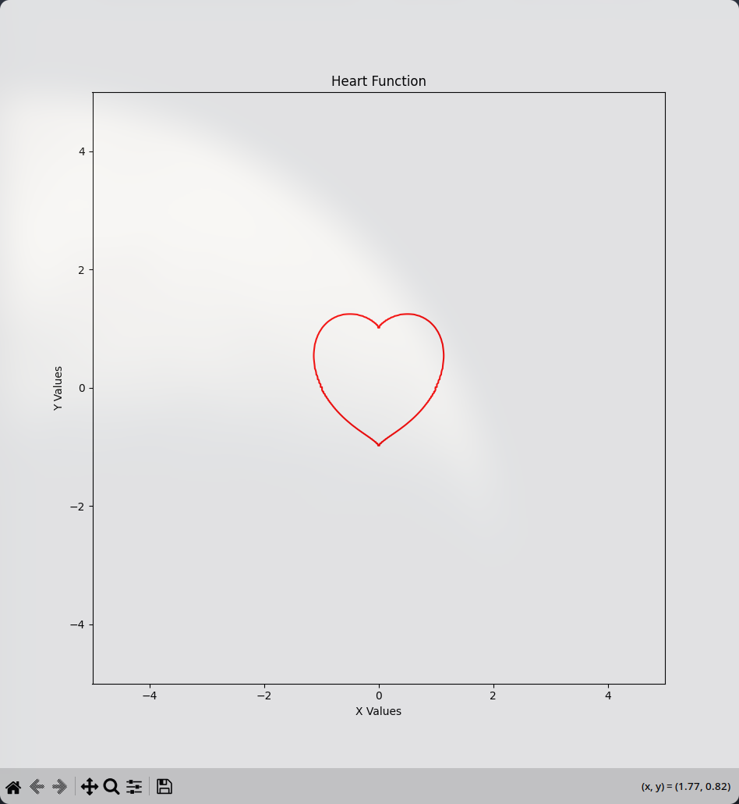

# Heart Function ❤

## Equation

```math
(x^2 + y^2 - 1)^3 - x^2 * y^3 = 0
```

## Results


## Why this equation? && How this works?

The equation `x^2 + y^2 - 1 = 0` is the equation of the circle, which is the base structure for the heart.

### Why it is cubed though?

By cubing the eqn of the circle, it still gives a circle. But outside the circle, it grows significantly. (Used in the case where there is a bump on the top)

### What is that `x^2 * y^3` term?

- `x^2` ensures symmetry with respect to the y-axis
- `y^3` is responsible for that taper in bottom of the heart

### Is this the only equation that works?

Definitely Not!
Here are the results of various equations with the same logic

1. `(x^2 + y^2 - 1)^5 - x^4 * y^5 = 0`
   

2. `(x^2 + y^2 - 1)^13 - x^8 * y^13 = 0`
   
